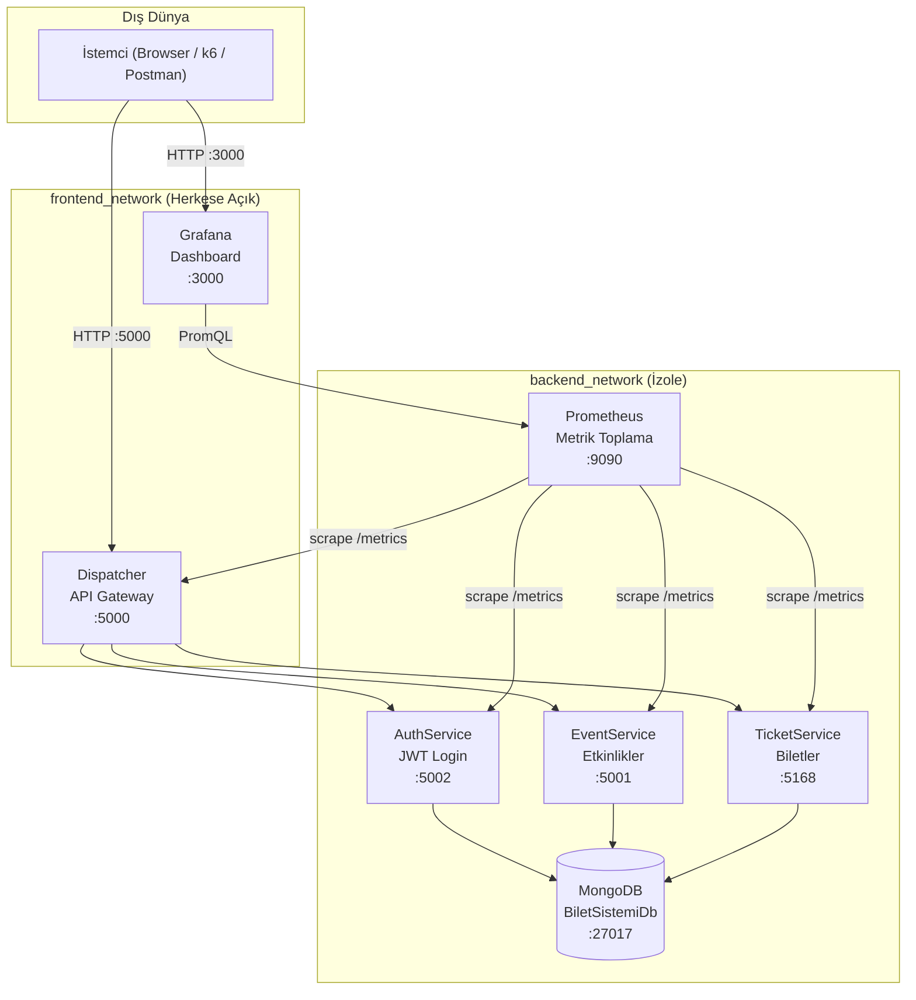
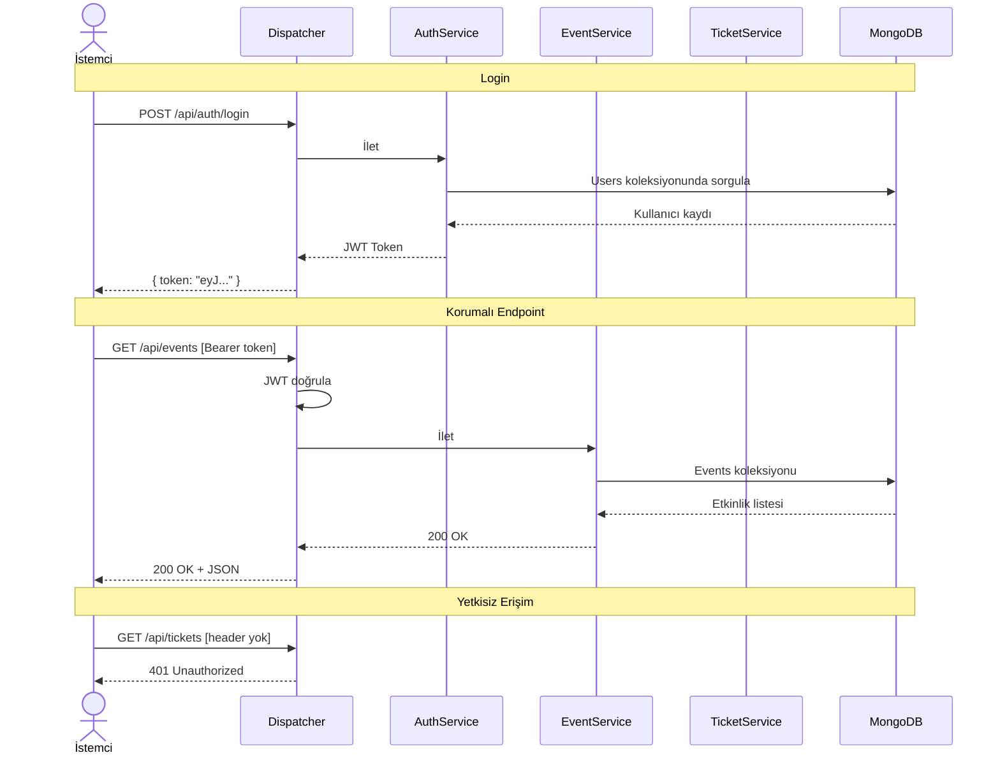
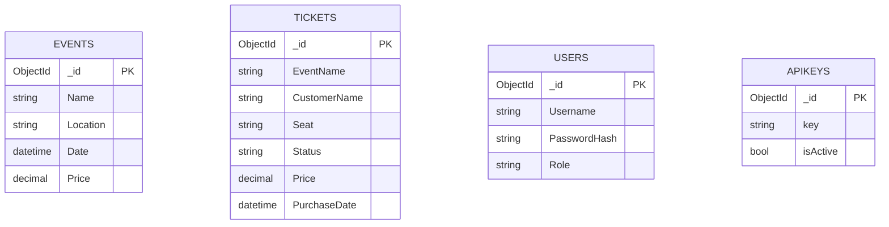
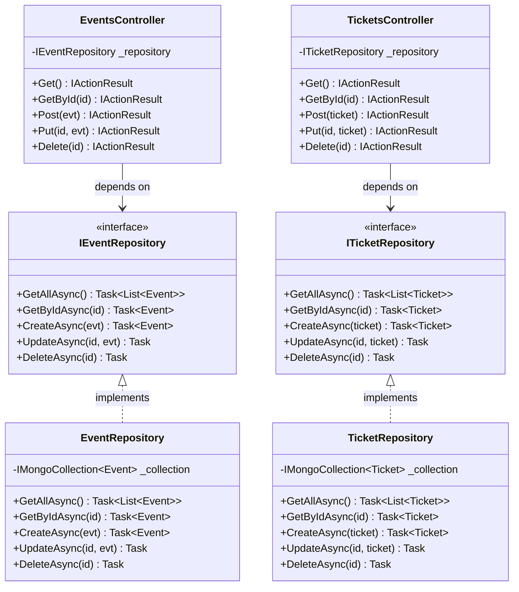

# Bilet Sistemi

.NET 10 tabanlı, Docker Compose üzerinde çalışan mikroservis bilet satış uygulaması. Dört servis, bir API gateway, MongoDB ve Grafana monitoring'den oluşuyor.

---

## Mimari



Tüm iç servisler `backend_network`'te çalışır ve dışarıya kapalıdır. Dışarıdan sadece Dispatcher (5000) ve Grafana (3000) erişilebilir.

---

## İstek Akışı



---

## Veritabanı



---

## Repository Pattern (SOLID)



Controller'lar doğrudan MongoDB'ye dokunmuyor; her şey interface üzerinden gidiyor. Test yazarken mock geçirmek bu sayede kolay oluyor.

---

## API

Bütün istekler Dispatcher'a (port 5000) gönderilir. Dispatcher ilgili servise yönlendirir.

**Kimlik doğrulama:**
- `X-Api-Key: KingoSifre123`
- `Authorization: Bearer <token>`

`/api/auth/*` endpoint'leri için kimlik doğrulama gerekmez.

| Method | Endpoint | Auth | Açıklama |
|--------|----------|:----:|----------|
| POST | `/api/auth/login` | — | JWT al |
| POST | `/api/auth/validate` | — | Token kontrol |
| GET | `/api/events` | ✓ | Tüm etkinlikler |
| GET | `/api/events/{id}` | ✓ | Etkinlik detayı |
| POST | `/api/events` | ✓ | Etkinlik ekle |
| PUT | `/api/events/{id}` | ✓ | Etkinlik güncelle |
| DELETE | `/api/events/{id}` | ✓ | Etkinlik sil |
| GET | `/api/tickets` | ✓ | Tüm biletler |
| GET | `/api/tickets/{id}` | ✓ | Bilet detayı |
| POST | `/api/tickets` | ✓ | Bilet ekle |
| PUT | `/api/tickets/{id}` | ✓ | Bilet güncelle |
| DELETE | `/api/tickets/{id}` | ✓ | Bilet sil |

---

## Kurulum

Docker ve Docker Compose kurulu olması yeterli.

```bash
# Servisleri derle ve başlat
docker-compose up --build

# Arka planda çalıştırmak istersen
docker-compose up --build -d
```

Ayağa kalktıktan sonra:

| Adres | Ne |
|-------|----|
| http://localhost:5000 | Bilet satın alma arayüzü |
| http://localhost:3000 | Grafana (admin / bilet2026) |

---

## Kullanım Örnekleri

```bash
# Token al
curl -s -X POST http://localhost:5000/api/auth/login \
  -H "Content-Type: application/json" \
  -d '{"Username":"admin","Password":"Bilet2026"}' | jq .

# Etkinlikleri listele (X-Api-Key ile)
curl http://localhost:5000/api/events \
  -H "X-Api-Key: KingoSifre123"

# Etkinlikleri listele (JWT ile)
curl http://localhost:5000/api/events \
  -H "Authorization: Bearer <yukaridan_gelen_token>"

# Yeni bilet oluştur
curl -X POST http://localhost:5000/api/tickets \
  -H "X-Api-Key: KingoSifre123" \
  -H "Content-Type: application/json" \
  -d '{"EventName":"Tarkan Konseri","CustomerName":"Ahmet Yılmaz","Seat":"A-12","Price":500}'
```

---

## Yük Testi (k6)

```bash
# Standart yük testi (10→50 VU)
k6 run k6/load-test.js

# Stres testi — 4 farklı yük seviyesi
for VUS in 50 100 200 500; do
    k6 run --env VUS=$VUS \
           --env BASE_URL=http://localhost:5000 \
           --env API_KEY=KingoSifre123 \
           k6/stress-test.js
    [ $VUS -ne 500 ] && sleep 30
done
```

Sonuçlar `k6/results/` altına JSON olarak yazılır.

**50-100 VU arası sorunsuz çalışıyor. 200 VU'da P95 gecikme 5s'ye çıkıyor, 500 VU'da sistem zorlanıyor.**

---

## Servisler

| Servis | Port | Dışarıdan erişim | Ne yapıyor |
|--------|------|:----------------:|------------|
| Dispatcher | 5000 | Evet | API Gateway, auth, yönlendirme |
| Grafana | 3000 | Evet | Metrik dashboard |
| AuthService | 5002 | Hayır | Kullanıcı doğrulama, JWT üretimi |
| EventService | 5001 | Hayır | Etkinlik CRUD |
| TicketService | 5168 | Hayır | Bilet CRUD |
| Prometheus | 9090 | Hayır | Metrik toplama |
| MongoDB | 27017 | Hayır | Veritabanı |
