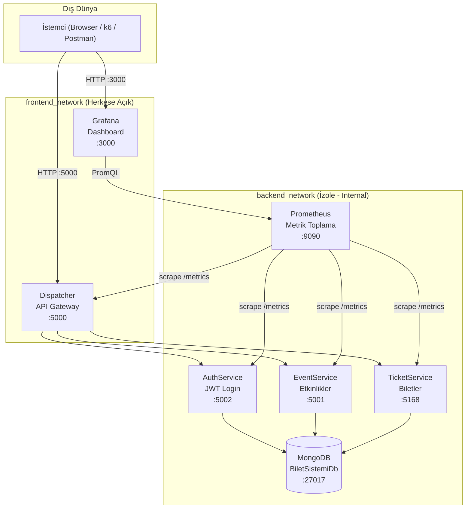
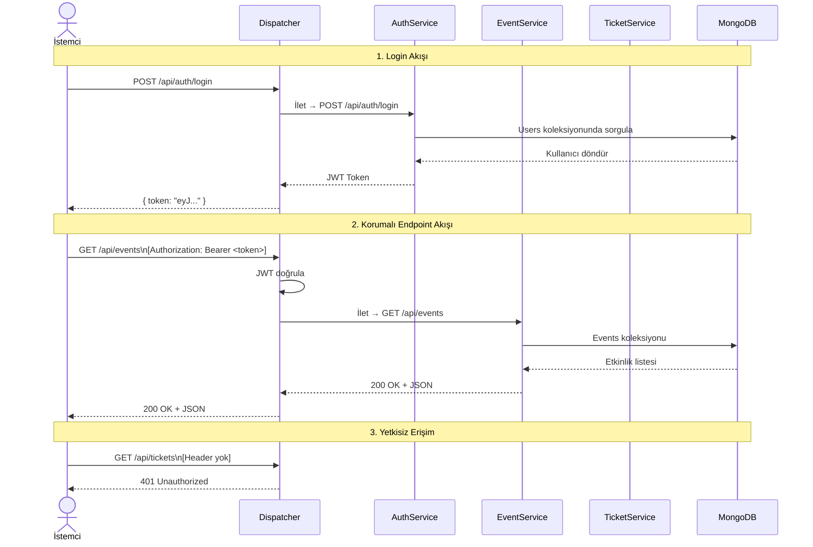
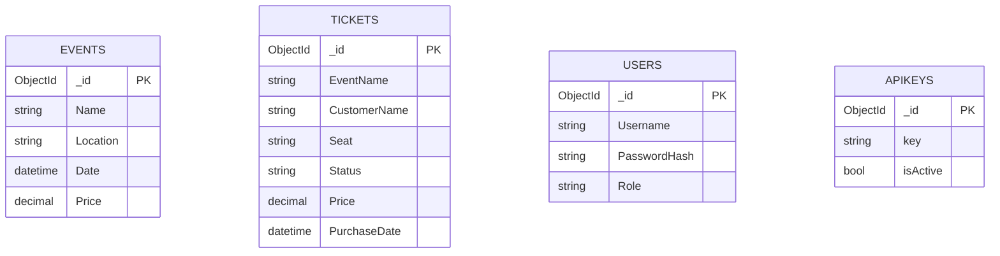
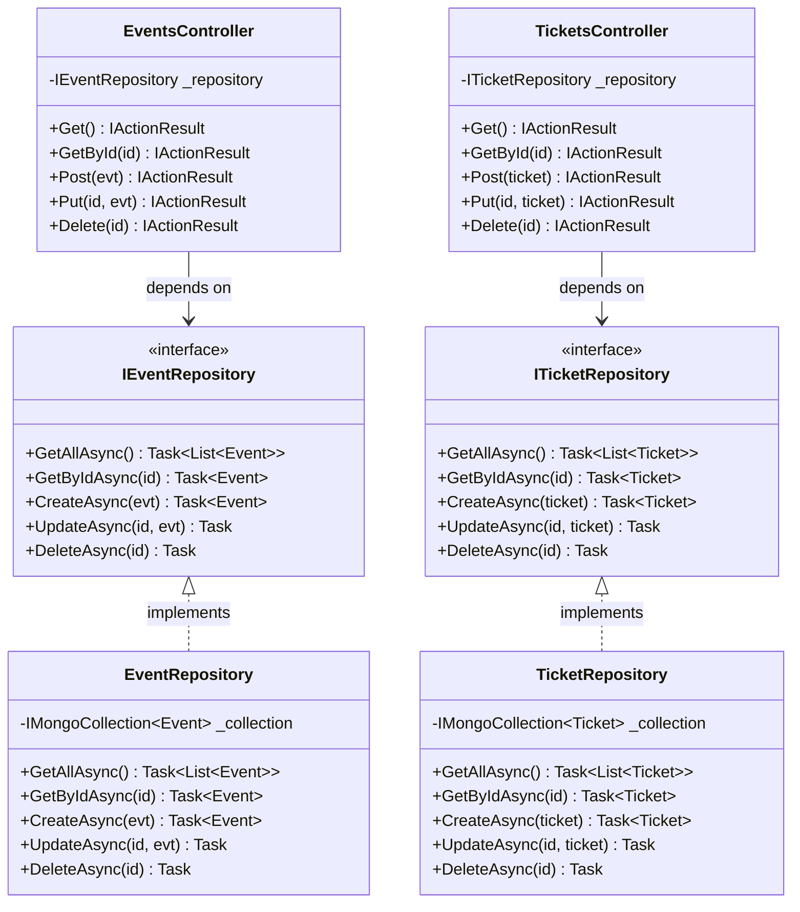

# Bilet Sistemi - Mikroservis Mimarisi

.NET 10 tabanlı, Docker Compose ile orkestre edilen, MongoDB destekli bilet satış sistemi.

---

## Mimari Genel Görünüm



---

## İstek Akışı (Sequence Diagram)



---

## Veritabanı Şeması



---

## SOLID / OOP Katman Diyagramı



---

## API Referansı

### Dispatcher (Port 5000) - Tüm İstekler Buradan

| Method | Endpoint | Auth | Açıklama |
|--------|----------|------|----------|
| POST | `/api/auth/login` | Yok | JWT token al |
| POST | `/api/auth/validate` | Yok | Token doğrula |
| GET | `/api/events` | Gerekli | Tüm etkinlikler |
| GET | `/api/events/{id}` | Gerekli | Etkinlik detayı |
| POST | `/api/events` | Gerekli | Etkinlik oluştur |
| PUT | `/api/events/{id}` | Gerekli | Etkinlik güncelle |
| DELETE | `/api/events/{id}` | Gerekli | Etkinlik sil |
| GET | `/api/tickets` | Gerekli | Tüm biletler |
| GET | `/api/tickets/{id}` | Gerekli | Bilet detayı |
| POST | `/api/tickets` | Gerekli | Bilet oluştur |
| PUT | `/api/tickets/{id}` | Gerekli | Bilet güncelle |
| DELETE | `/api/tickets/{id}` | Gerekli | Bilet sil |

**Auth header seçenekleri:**
- `X-Api-Key: KingoSifre123`
- `Authorization: Bearer <jwt_token>`

---

## Kurulum ve Çalıştırma

```bash
# 1. Tüm servisleri başlat
docker-compose up --build

# 2. Servislere eriş
# Ana sayfa:   http://localhost:5000
# Grafana:     http://localhost:3000  (admin / bilet2026)

# 3. Token al
curl -X POST http://localhost:5000/api/auth/login \
  -H "Content-Type: application/json" \
  -d '{"username":"admin","password":"Admin123!"}'

# 4. Etkinlikleri listele (X-Api-Key ile)
curl http://localhost:5000/api/events \
  -H "X-Api-Key: KingoSifre123"

# 5. k6 yük testi çalıştır
k6 run k6/load-test.js
```

---

## Servis Portları (Docker İçi)

| Servis | Port | Dışa Açık | Açıklama |
|--------|------|-----------|----------|
| Dispatcher | 5000 | Evet | API Gateway |
| AuthService | 5002 | Hayır | JWT Login |
| EventService | 5001 | Hayır | Etkinlik CRUD |
| TicketService | 5168 | Hayır | Bilet CRUD |
| MongoDB | 27017 | Hayır | Veritabanı |
| Prometheus | 9090 | Hayır | Metrik toplama |
| Grafana | 3000 | Evet | Dashboard |
