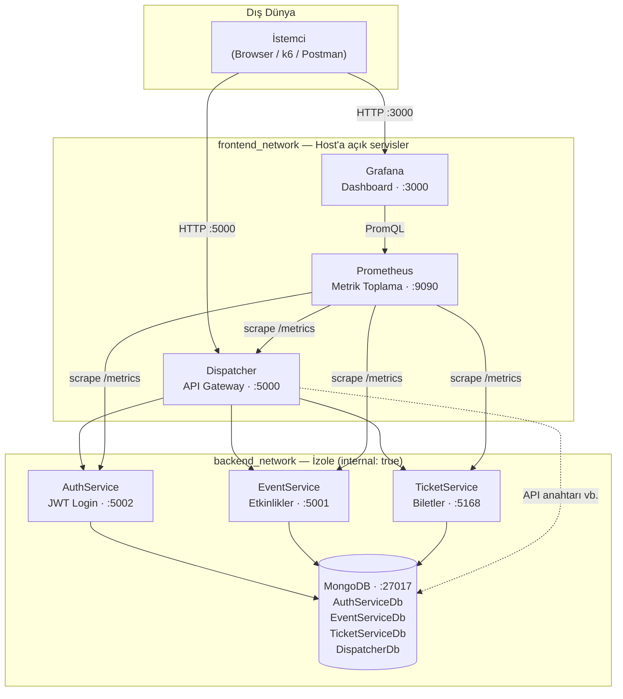
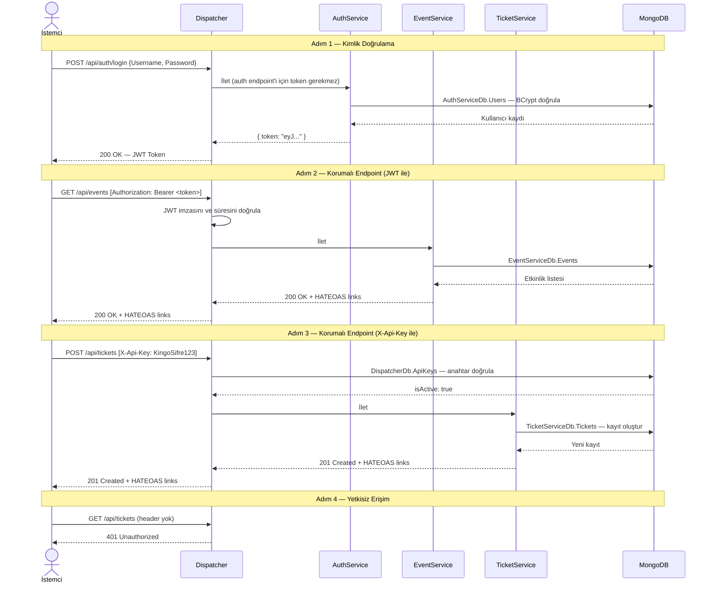
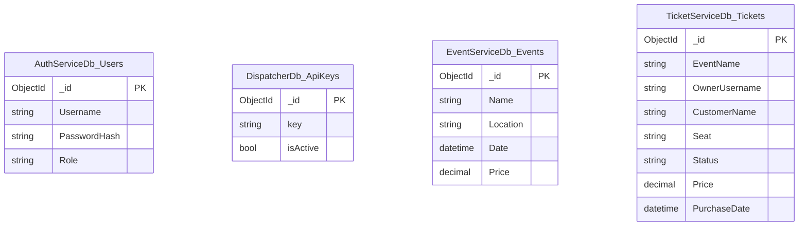
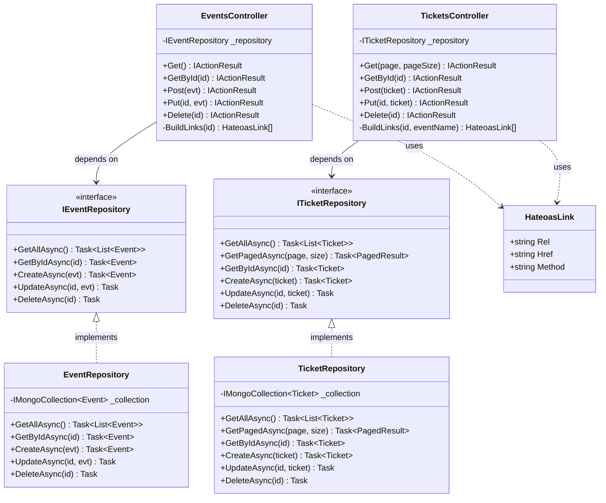

# Mikroservis Tabanlı Bilet Satış Sistemi

| | |
|---|---|
| **Proje Adı** | Mikroservis Tabanlı Bilet Satış Sistemi |
| **Ekip Üyeleri** | Yusuf Can Müştekin-231307082,Uğuralp Kıvanç-231307081 |
| **Tarih** | Mart 2026 |
| **Üniversite** | Kocaeli Üniversitesi,Bilişim Sistemleri Mühendisliği |

---

## 1. Giriş

### Problemin Tanımı

Geleneksel monolitik mimarilerde, sistemin herhangi bir bileşeninde yaşanan yük artışı veya hata tüm uygulamayı etkiler. Bilet satış sistemleri özellikle konser ve etkinlik dönemlerinde ani trafik artışlarına maruz kalır; bu durum monolitik yapılarda hem ölçeklendirme hem de bakım güçlükleri doğurur.

### Amaç

Bu projede; her biri bağımsız deploy edilebilen, kendi veritabanını yöneten ve REST standartlarına uygun HTTP API sunan mikroservislerden oluşan bir bilet satış sistemi geliştirilmiştir. Temel hedefler şunlardır:

- Servislerin birbirinden bağımsız geliştirilip ölçeklendirilebilmesi
- API güvenliğinin JWT ve API anahtarı ile sağlanması
- REST olgunluk modelinin 3. seviyesine (HATEOAS) ulaşılması
- Test güdümlü geliştirme (TDD) ile kod kalitesinin artırılması
- Prometheus ve Grafana ile sistem gözlemlenebilirliğinin kurulması

---

## 2. Sistem Mimarisi

 Sistem iki Docker ağına bölünmüştür. **İstemci için ana giriş** `Dispatcher` (**5000**) — API ve web arayüzü; **yönetim ve pano** için **Grafana (3000)**. Bu repodaki `docker-compose.yml`, geliştirme ve izleme kolaylığı için **Prometheus (9090)** ile **MongoDB (27017)** portlarını da host makineye yönlendirir; üretimde bu portlar kapatılabilir veya kısıtlanabilir.
**Auth**, **Event**, **Ticket** mikroservisleri ve **MongoDB** konteyner trafiği `internal: true` arka ağ üzerinden yürür; bu servislerin HTTP portları doğrudan dışarı publish edilmez. **Dispatcher** ayrıca aynı MongoDB sunucusunda **`DispatcherDb`** veritabanını (API anahtarları vb.) kullanır.




### Teknoloji Yığını

| Katman | Teknoloji |
|--------|-----------|
| Çerçeve | .NET 10 — ASP.NET Core Minimal API + MVC Controllers |
| Veritabanı | MongoDB 8 (her servise ayrı DB; Dispatcher için ek olarak DispatcherDb) |
| Kimlik Doğrulama | JWT (System.IdentityModel.Tokens.Jwt) + BCrypt |
| Orkestrasyon | Docker Compose |
| Metrik | prometheus-net.AspNetCore + Grafana 11 |
| Yük Testi | k6 |

---

## 3. Servisler Arası İstek Akışı


Her servis kendi MongoDB veritabanını kullanır; Dispatcher ek olarak DispatcherDb ile API anahtarlarını saklar. Böylece bir servisin şema değişikliği diğerlerini doğrudan etkilemez.
---

## 4. Veritabanı Yapısı



OwnerUsername alanı, biletin hangi hesaba ait olduğunu gösterir (JWT içindeki kullanıcı adı). Boş olabilir: eski kayıtlar veya yalnızca API anahtarı ile oluşturulan biletler için.
---

## 5. Sınıf Diyagramı

Repository Pattern uygulanmıştır. Controller'lar doğrudan MongoDB'ye bağlı değildir; interface üzerinden konuşur. Bu, birim testlerinde sahte (mock) implementasyon geçirmeyi kolaylaştırır.



---

## 6. API Endpoint Tablosu

Tüm istekler Dispatcher'a (port 5000) gönderilir.

**Kimlik doğrulama seçenekleri:**
- `X-Api-Key: KingoSifre123 (DispatcherDb'de kayıtlı anahtar)`
- `Authorization: Bearer <jwt_token>`

`/api/auth/*` endpoint'leri için kimlik doğrulama gerekmez.

| Method | Endpoint | Auth | HTTP Kodu | Açıklama |
|--------|----------|:----:|:---------:|----------|
| POST | `/api/auth/login` | — | 200 | JWT token al |
| POST | `/api/auth/register` | — | 201 / 400 / 409 | Yeni kullanıcı kaydı (role: user) |
| POST | `/api/auth/validate` | — | 200 | Token doğrula |
| GET | `/api/events` | ✓ | 200 | Tüm etkinlikler |
| GET | `/api/events/{id}` | ✓ | 200 / 404 | Etkinlik detayı |
| POST | `/api/events` | ✓ | 201 | Etkinlik ekle |
| PUT | `/api/events/{id}` | ✓ | 200 / 404 | Etkinlik güncelle |
| DELETE | `/api/events/{id}` | ✓ | 204 / 404 | Etkinlik sil |
| GET | `/api/tickets?page=1&pageSize=10` | ✓ | 200 | Sayfalı bilet listesi |
| GET | `/api/tickets/{id}` | ✓ | 200 / 404 | Bilet detayı |
| POST | `/api/tickets` | ✓ | 201 | Bilet oluştur |
| PUT | `/api/tickets/{id}` | ✓ | 200 / 404 | Bilet güncelle |
| DELETE | `/api/tickets/{id}` | ✓ | 204 / 404 | Bilet sil |

---

## 7. Richardson Olgunluk Modeli

Bu projede REST API'ler Richardson Olgunluk Modeli'nin 3. seviyesine göre tasarlanmıştır.

| Seviye | Özellik | Bu Projede |
|--------|---------|------------|
| **Seviye 0** | Tek endpoint, RPC tarzı | — |
| **Seviye 1** | Kaynaklar (`/events`, `/tickets`) | ✓ |
| **Seviye 2** | HTTP metodları ve durum kodları (GET/POST/PUT/DELETE, 200/201/204/404) | ✓ |
| **Seviye 3** | HATEOAS — her yanıtta hypermedia linkleri | ✓ |

### HATEOAS Örneği

Bilet oluşturulduğunda dönen yanıtta, istemcinin bir sonraki adımda yapabileceği tüm işlemler `links` alanında taşınır. İstemcinin URL'leri önceden bilmesine gerek yoktur.

```json
{
  "data": {
    "id": "69c8e915...",
    "eventName": "Tarkan Konseri",
    "customerName": "Ahmet Yılmaz",
    "seat": "A-12",
    "price": 500
  },
  "links": [
    { "rel": "self",           "href": "/api/tickets/69c8e915...", "method": "GET"    },
    { "rel": "update",         "href": "/api/tickets/69c8e915...", "method": "PUT"    },
    { "rel": "delete",         "href": "/api/tickets/69c8e915...", "method": "DELETE" },
    { "rel": "collection",     "href": "/api/tickets",             "method": "GET"    },
    { "rel": "related-events", "href": "/api/events",              "method": "GET"    }
  ]
}
```

Sayfalı bilet listesinde navigasyon linkleri de yer alır:

```json
{
  "pagination": { "page": 2, "pageSize": 10, "totalCount": 35, "totalPages": 4 },
  "links": [
    { "rel": "self",   "href": "/api/tickets?page=2&pageSize=10", "method": "GET" },
    { "rel": "first",  "href": "/api/tickets?page=1&pageSize=10", "method": "GET" },
    { "rel": "prev",   "href": "/api/tickets?page=1&pageSize=10", "method": "GET" },
    { "rel": "next",   "href": "/api/tickets?page=3&pageSize=10", "method": "GET" },
    { "rel": "last",   "href": "/api/tickets?page=4&pageSize=10", "method": "GET" }
  ]
}
```

---

## 8. Test Güdümlü Geliştirme (TDD)

Proje boyunca Red-Green-Refactor döngüsü uygulanmıştır.

```
Red    → Önce başarısız bir test yaz (henüz kod yok)
Green  → Testi geçirecek kadar, sadece o kadar kod yaz
Refactor → Testi bozmadan kodu temizle
```

### Uygulanan Testler

Dispatcher'ın davranışı Dispatcher.Tests/DispatcherRoutingTests.cs içinde WebApplicationFactory<Program> ile entegrasyon testlerine alınmıştır. Örnek doğrulamalar:

 `/api/events/*` isteklerinin EventService'e iletilmesi
- `/api/tickets/*` isteklerinin TicketService'e iletilmesi
- `GET /api/events` ve `GET /api/tickets` isteklerinde kimlik bilgisi yokken Gateway'in 401 dönmesi
- Geçerli X-Api-Key ile geçersiz veya bilinmeyen servis yolunda 400 dönmesi
- Kimlik doğrulama başarısız olduğunda 401 dönmesi
- `/api/auth/*` isteklerinin kimlik doğrulama olmadan geçmesi

Bu davranışlar çalışan Docker ortamında uçtan uca doğrulanır. Auth-, Event- ve TicketService için ayrı birim test projeleri bu repoda zorunlu tutulmamıştır.
TDD'nin projeye katkısı şu oldu: Dispatcher'ın yönlendirme mantığını yazmadan önce beklenen davranışı test olarak tanımladık. Bu sayede yönlendirme kurallarını değiştirirken mevcut testler bizi korudu.

---

## 9. Kurulum

Docker ve Docker Compose yüklü olması yeterli.

```bash
# Tüm servisleri derle ve başlat
docker-compose up --build

# Arka planda çalıştırmak için
docker-compose up --build -d
```

Ayağa kalktıktan sonra erişim noktaları:

| Adres | Amaç |
|-------|----|
| http://localhost:5000 | API Gateway ve bilet web arayüzü (birincil istemci girişi) |
| http://localhost:3000 | Grafana — admin / bilet2026 (metrik panosu) |
| http://localhost:9090 | Prometheus UI (compose ile host’a açık)|
| http://localhost:27017 | MongoDB (compose ile host’a açık; geliştirme/yardımcı erişim) |

### Örnek İstekler

```bash
# JWT token al
curl -s -X POST http://localhost:5000/api/auth/login \
  -H "Content-Type: application/json" \
  -d '{"Username":"admin","Password":"Bilet2026"}' | jq .

# Etkinlikleri listele (X-Api-Key ile)
curl http://localhost:5000/api/events \
  -H "X-Api-Key: KingoSifre123"

# Biletleri sayfalı getir
curl "http://localhost:5000/api/tickets?page=1&pageSize=10" \
  -H "X-Api-Key: KingoSifre123"

# Yeni bilet oluştur
curl -X POST http://localhost:5000/api/tickets \
  -H "X-Api-Key: KingoSifre123" \
  -H "Content-Type: application/json" \
  -d '{"EventName":"Tarkan Konseri","CustomerName":"Ahmet Yılmaz","Seat":"A-12","Price":500}'
```

---

## 10. Yük Testi Sonuçları

Repoda k6/load-test.js bulunur. Bu script aşamalı yük kullanır (ör. 30 sn yükseliş, 1 dk sabit, kısa süreli spike, düşüş) ve her iterasyonda sırasıyla login, GET /api/events, GET /api/tickets, POST /api/tickets çağrılarını içerir.

Aşağıdaki tablo farklı sanal kullanıcı (VU) seviyelerinde yapılan örnek stres testi koşularına aittir; sayılar belirli bir donanım ve ortamda alınmıştır ve load-test.js içindeki aşama süreleri ile birebir aynı parametreleri ifade etmeyebilir.

| VU | Toplam İstek | İstek/sn | Hata Oranı | Ort. Süre | P95 Süre | Durum |
|----|-------------|---------|-----------|----------|---------|-------|
| 50 | 7.312 | 103 | %0,00 | 124 ms | 431 ms | ✓ Geçti |
| 100 | 7.588 | 107 | %0,00 | 499 ms | 1.798 ms | ✓ Geçti |
| 200 | 6.776 | 95 | %0,00 | 1.519 ms | 5.141 ms | ✗ P95 aştı |
| 500 | 6.548 | 84 | %8,14 | 4.879 ms | 15.585 ms | ✗ Hata + P95 aştı |

**Yorum:** Sistem 100 eş zamanlı kullanıcıya kadar hatasız çalışmaktadır. 200 VU'da hata yoktur ancak P95 gecikme 5 saniyeye çıkmaktadır. 500 VU'da bağlantı zaman aşımları nedeniyle %8 hata görülmüştür. Darboğaz MongoDB'dir; tek bir instance tüm servislere hizmet vermektedir. Üretim ortamında MongoDB replica set veya connection pooling ayarları bu sorunu çözecektir.

---

## 11. Sonuç ve Tartışma

### Başarılar

- Dört bağımsız mikroservis Docker Compose ile tek komutla ayağa kaldırılabiliyor
- Mikroservisler iç ağda; ana kullanıcı uçları 5000 ve 3000; Prometheus ve MongoDB portları bu compose’ta ek olarak host’a yönlendirilmiş
- REST API'ler Richardson Olgunluk Modeli'nin 3. seviyesine (HATEOAS) taşındı
- Her servis kendi MongoDB veritabanını kullandığından şema değişiklikleri izole kalıyor
- Prometheus + Grafana ile tüm servislerin HTTP metrikleri tek panelden izlenebiliyor
- TDD ile Dispatcher yönlendirme mantığı test kapsamına alındı

### Sınırlılıklar

- MongoDB tek instance çalışıyor; 200 VU üzerinde gecikme artışı buradan kaynaklanıyor
- Servisler arası doğrudan iletişim yok; bir bilet oluşturulduğunda etkinliğin gerçekten var olup olmadığı doğrulanmıyor
- JWT token yenileme (refresh token) mekanizması yok; token süresi dolunca yeniden login gerekiyor
- Dispatcher tüm trafiği seri işliyor; yatay ölçekleme için load balancer eklenmeli

### Geliştirme Önerileri

- MongoDB'yi replica set veya sharded cluster olarak yapılandırmak
- Servisler arası event-driven iletişim için RabbitMQ veya Kafka entegrasyonu
- Her servis için ayrı ayrı yatay ölçekleme (Kubernetes)
- Refresh token desteği ve token blacklist mekanizması
- EventService ile TicketService arasında referans bütünlüğü kontrolü

---

## Servis Portları

| Servis | Port | Dışarıdan Erişim | Açıklama |
|--------|------|:----------------:|----------|
| Dispatcher | 5000 | Evet | API Gateway |
| Grafana | 3000 | Evet | Metrik dashboard |
| Prometheus | 9090 | Evet | Metrik toplama |
| MongoDB | 27017 | Evet | Veritabanı |
| AuthService | 5002 | Hayır | Kullanıcı doğrulama, JWT |
| EventService | 5001 | Hayır | Etkinlik CRUD |
| TicketService | 5168 | Hayır | Bilet CRUD |
